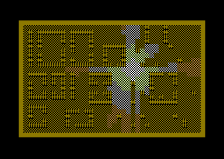

Title: Fast Marching Methods on C64
Date: 2019-05-26
Category: programming
Summary: Implementation of Fast Marching Methods for the C64. One big trick to make it run in O(N) and a lots of small tricks to make the constant very small.

In 2007, while still a student, I learned of the [Fast Marching Method](https://en.wikipedia.org/wiki/Fast_marching_method), originally proposed by [J.A. Sethian](https://math.berkeley.edu/~sethian/). The algorithm operates on a grid, consisting of cells, each with different "slowness" (finite or infinite). The algorithm finds the shortest arrival time to each cell, similar to Djikstra's algorithm, but with a proper Euclidian norm. Applications of Fast Marching Methods include computing the shortest path for a robot navigating a maze or computing the shadows of point-like light sources. Which is to say, they are very useful in robotics or computer games.  

In both Fast Marching Method and Djikstra's algorithm, all cells are first unvisited, and one or more of the cells are given tentative arrival times. Then, one cell at time, from the cells with tentative arrival times, the cell with smallest arrival time is marked as accepted and the tentative arrival times are considered for the unvisited neighbours. The difference in the algorithms is how the tentative arrival times are computed.

Both algorithms have a running time of O(N log N), where N is the number of cells visited. log N comes from the fact that the cells with tentative arrival times are kept in a priority queue, from which it is log(N) operation to remove the cell with the smallest tentative arrival time.

Back then I learned that [Yatziv, Bartesaghi and Sapiro](https://doi.org/10.1016/j.jcp.2005.08.005) had proposed a version that runs in O(N). Here the idea was that the priority queue was replaced with an "untidy priority queue": the considered cells are kept in a finite number of bins, but within each bin, there's no internal ordering. Instead of removing the smallest element from the queue, we remove any element from the smallest bin. The bins can be implemented as simple linked lists so adding and removing are O(1) operations and thus the total running time of the algorithm is O(N). The slightly wrong ordering of the priority queue can create minor errors in the output, but Yatziv, Bartesaghi and Sapiro and following research proved that the error can be negligible.

As a part of my studies, I was to take a special assignment in Computational Science and Engineering. I proposed to implement and test the algorithm of Yatziv, Bartesaghi and Sapiro and compare it to the original. [Here's my student report](pdfs/LTTErikoistyo_Sariola.pdf), from 2007. Unfortunately, the report is in Finnish, but non-speakers can enjoy the pictures of shadows from point-like light sources.

Fast forward to today, I thought it would be fun to implement the algorithm on the C64, writing in the assembly language. The method uses a first order difference method. The O(N) trick was taken one step further so that when accepting a cell, all cells in a bin get the same, integer value. Furthermore, several smaller tricks were done to make the constant small:

* All math is 8-bit integers and solutions to the eikonal equation are found using table lookups. For example, when using a slowness of 15, from a starting cell the algorithm can search 240/15 = 16 cells away. Actually, it can search 249/15 = 16.6 cells away if one willing to accept a small bug every now and then :)
* Priorities are never updated in the priority queue, because in 2D, usually the priority gets updated only once if at all. Instead, a cell can be added several (usually two) times to the priority queue and when considering a cell, we just check if it has been already accepted and skip it in the case it has. This saves enormous amount of memory because we don't need backpointers for the cells to update their priorities in the queue. I found this to be in the order of 30% faster than actually updating the cell.
* When a cell is considered for the first time, a special temporary value is written to the output array. For example, if the cell considered was north, then a temporary value NORTH = 255 is written to the output array. Next time, when this cell is considered, if there is one of these temporary values, we know to which direction is the smallest cell and if the currently just-accepted cell is diagonal to that, we know which two cells should be used to solve the eikonal equation. Such cell is marked as NEAR = 250 and needs not be considered again. Such a cell is then finally given an arrival time < 250 when it is finally accepted.
* The elements are not removed from the smallest bin one by one, but once we are finished with the smallest bin, the whole bin is freed at once. Bins are singly linked lists so "freeing" the bin is just tying the freed list to an another linked list of unused elements.
* Finally, code was carefully optimized by counting cycles in a debugger and doing the usual assembly optimizations (not setting processor flags if they can be proven to be always in known state etc.). The code was primarily optimized for speed, not size, but the algorithm is still only 512b.

Here's a demo of line of sight / shadow calculations, running on VICE.

Sources and more explanations can be found from the [repository](https://github.com/vsariola/c64-fast-marching).